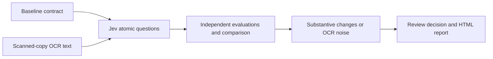

<div align="center">

# Jev Audit

**See what changed. Understand what matters. Review with confidence.**

An AI-powered contract comparison tool built around **Jev atomic evaluations**. Compare a baseline contract with text extracted from a scanned copy, separate substantive changes from OCR noise, and turn the findings into a reviewable report.


`Jev` · `Contract Audit` · `OCR Noise Detection` · `OpenAI` · `AI SDK`

</div>

## Why Jev Audit?

Scanned contracts often mix harmless recognition errors with changes that affect the deal. A misread character is one thing; a payment deadline moving from **30 days to 60 days** is another. A plain text diff shows both, but does not tell a reviewer where to focus.

Jev Audit breaks review criteria into independent Jev questions, evaluates each document, and brings differences, evidence, and review routing into one report. It helps people find the important changes faster while keeping the final decision with the reviewer.

## What you can do

| Capability | What it does |
| --- | --- |
| Compare two contracts | Paste or import the baseline and scanned-copy OCR text to inspect word-level differences and clause risks. |
| Define Jev evaluations | Build review criteria with `noul` (yes/no), `choice` (category), and `score` (rating) questions. Edit or import the JSON configuration. |
| Generate questions with AI | Describe what matters to you and generate tailored Jev questions and evaluation instructions. |
| Support review routing | Summarize substantive changes, OCR noise, consistency, and risk to suggest auto-pass or human review. |
| Share the findings | Inspect differences and atomic results, copy the conclusion, or export an HTML report that can be printed to PDF. |
| Explore in two languages | Switch between English and Chinese and load sample contracts to try the full flow. |

## Quick start

You need Node.js and an OpenAI API key. If this is your first run, copy [`.env.example`](.env.example) to `.env` and set `OPENAI_API_KEY`. Keep an existing `.env` file if you already configured one.

```bash
npm install
npm run dev
```

Open **http://localhost:3000** after the server starts. In Windows PowerShell, you can copy the example configuration with `Copy-Item .env.example .env`.

To explore the app, load a sample scenario, adjust the Jev criteria if needed, and run the audit. To create new criteria, enter your review focus in the Jev configuration panel.

## Deploy from Git with Portainer

1. In Portainer, select **Stacks → Add stack → Git repository**.
2. Enter `https://github.com/neozhu/jev-audit.git` as the repository URL and `docker-compose.yml` as the Compose path.
3. In the stack's **Environment variables** section, add `OPENAI_API_KEY` with your key. Optionally set `OPENAI_MODEL`, `TYPESAFE_API_KEY`, and `PORT`.
4. Select **Deploy the stack** and open the host on port `3000`, or the port you configured.

The Compose file uses `${OPENAI_API_KEY}` and the other Portainer stack variables; it does not use `env_file`. `OPENAI_MODEL` defaults to `gpt-6-luna`, `TYPESAFE_API_KEY` defaults to empty, and `PORT` defaults to `3000`. Keep real keys in Portainer rather than committing them to the repository.

Portainer builds the image from the cloned repository. On a remote Docker environment, Portainer may reject Compose `build` steps; in that case, build and publish the image outside Portainer and replace `build: .` with an `image:` reference.

## Configuration

| Variable | Purpose |
| --- | --- |
| `OPENAI_API_KEY` | Required for OpenAI model calls. Used on the server; never commit a real key. |
| `OPENAI_MODEL` | OpenAI model ID. Defaults to `gpt-6-luna`. |
| `TYPESAFE_API_KEY` | Optional. When set, the app first calls the TypeSafe Jev System One API for atomic evaluations. `JEV_API_KEY` is also accepted. |
| `PORT` | Optional server port. Defaults to `3000`. |
| `DISABLE_HMR` | Optional. Set to `true` to disable Vite hot reload in development. |

See [`.env.example`](.env.example) for the full template. The server calls OpenAI through AI SDK. The default `gpt-6-luna` model uses `high` reasoning effort. Without a TypeSafe key, contract reviews use the OpenAI-powered Jev specification path.

## How it works



## Development

```bash
npm run lint   # TypeScript type check
npm run build  # Build the frontend
```

The frontend uses React, TypeScript, and Vite. The Express server talks to models through AI SDK and `@ai-sdk/openai`. Jev Audit is a review aid; verify consequential legal or business decisions against the original documents.
